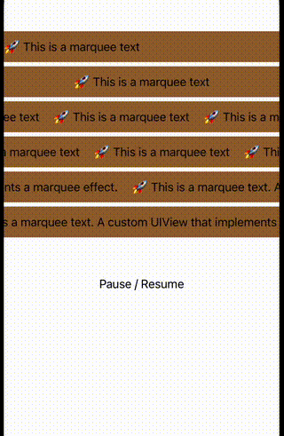

  

```ruby

pod 'Marquee' ,:git => 'https://github.com/568071718/marquee.git'
```

---  
swift  
```swift
import Marquee

let label = UILabel()
label.text = "🚀 A custom UIView that implements a marquee effect. This is a marquee text."

let marquee = Marquee(frame: CGRect(x: 0, y: 100, width: 300, height: 44.0))
marquee.content = label
view.addSubview(marquee)
```

objc  
```swift
@import Marquee;

UILabel *label = [[UILabel alloc] init];
label.text = @"🚀 A custom UIView that implements a marquee effect. This is a marquee text.";

YXMarqueeView *view = [[YXMarqueeView alloc] initWithFrame:CGRectMake(0, 100, 300, 44.0)];
view.content = label;
[self.view addSubview:view];
```
